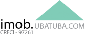

<p align="center">
  <a href="http://imobiliariaubatuba.com" target="_blank" title="Sistema Imobiliário - Imóveis em Ubatuba">
    
  </a>
</p>

<h1 align="center">Sistema Imobiliário — Imóveis em Ubatuba</h1>

<p align="center">
  Plataforma completa para gestão e publicação de imóveis no Litoral Norte de São Paulo.
</p>

<p align="center">
  
  
  
  
  
  
</p>

---

## 📋 Sobre o Projeto

Sistema web desenvolvido para imobiliárias do Litoral Norte de São Paulo, com foco em **Ubatuba**. Oferece gestão completa de imóveis, blog com publicação de artigos e notícias, integração com redes sociais e automações via Make.

---

## ✨ Funcionalidades

- 🏠 Cadastro e gestão de imóveis
- 📝 Blog com artigos e notícias
- 📸 Galeria de imagens com crop automático
- 📊 Painel administrativo completo
- 🤖 Automação de publicações via Make + IA (Gemini)
- 📱 Publicação automática no Facebook e Instagram
- 🔍 SEO otimizado

---

## 🛠️ Tecnologias

| Tecnologia | Versão |
|---|---|
| PHP | 8.1 |
| Laravel | 10.x |
| Livewire | 3.x |
| TailwindCSS | 3.x |
| Alpine.js | 3.x |
| MySQL | 8.x |

---

## 🚀 Instalação

```bash
# Clone o repositório
git clone https://github.com/seu-usuario/seu-repositorio.git

# Entre na pasta
cd seu-repositorio

# Instale as dependências
composer install
npm install

# Copie o .env
cp .env.example .env

# Gere a chave
php artisan key:generate

# Configure o banco no .env e rode as migrations
php artisan migrate --seed

# Compile os assets
npm run build
```

---

## ⚙️ Variáveis de Ambiente

```env
APP_URL=https://seusite.com.br

FILESYSTEM_DISK=public

MAKE_WEBHOOK_PUBLICAR=https://hook.us2.make.com/sua-url

GEMINI_API_KEY=sua-chave
```

---

## 👤 Colaboradores

<table>
  <tr>
    <td align="center">
      <a href="https://github.com/informaticalivreoficial">
        
        <br />
        <sub><b>Renato Montanari</b></sub>
      </a>
    </td>
  </tr>
</table>

---

## 📄 Licença

Este projeto está sob a licença [MIT](https://opensource.org/licenses/MIT).

---

<p align="center">Desenvolvido com ❤️ para o Litoral Norte de São Paulo</p>